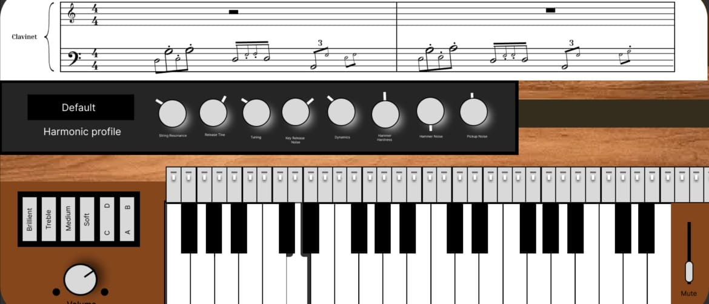

# About Application
As per task I completed all the interactive functionality and incorporated visual feedback for pressed keys to enhance user experience.

## Screenshots


After pressing key



# To Run Locally

>**Note**: Make sure you have **node<=v18.17.1** and must have **java<=v17**
## Step 1: npm install

After cloning project do **npm install** to install all pacakges.

```bash
npm install
```

## Step 2: Start Application

To start run application in connect and setup phone or run an emulator after run below command.
### For Android

```bash
npm start
# choice option a for android
# choice option i for ios
```


To learn more about React Native, take a look at the following resources:

- [React Native Website](https://reactnative.dev) - learn more about React Native.
- [Getting Started](https://reactnative.dev/docs/environment-setup) - an **overview** of React Native and how setup your environment.
- [Learn the Basics](https://reactnative.dev/docs/getting-started) - a **guided tour** of the React Native **basics**.
- [Blog](https://reactnative.dev/blog) - read the latest official React Native **Blog** posts.
- [`@facebook/react-native`](https://github.com/facebook/react-native) - the Open Source; GitHub **repository** for React Native.
